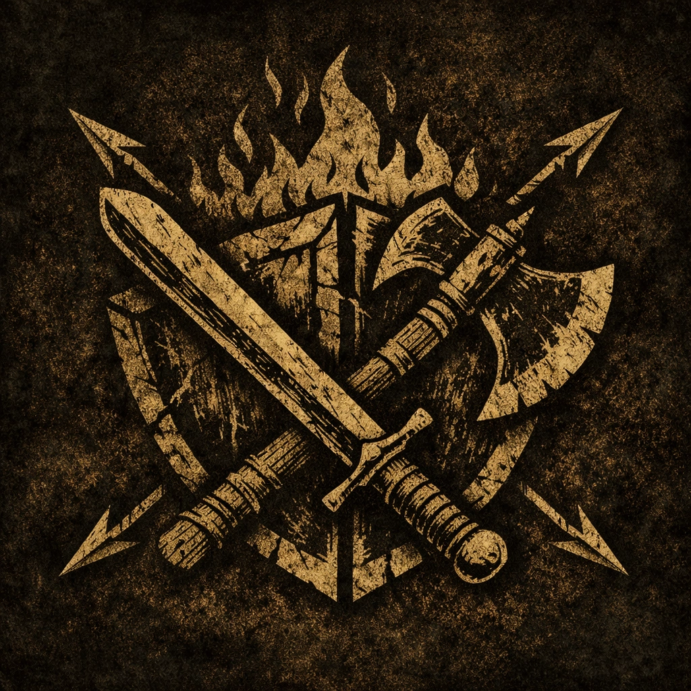

# WFRP4e – Battle Status

  

This module tracks and manages **battle-related status effects** in **Warhammer Fantasy Roleplay 4e**, starting with automated handling of the **Engaged** condition based on actual melee activity during combat.

It is designed to be **system-friendly**, **non-intrusive**, and fully compatible with standard WFRP4e combat workflows.

---

## ✦ Features

### **Automatic Engagement Tracking**
When two actors oppose each other in **melee combat**, the module:

• Automatically applies the **Engaged** condition to both actors  
• Tracks engagement pairs per combat round  
• Refreshes engagement only when melee interaction actually occurs  

Engagement is **not persistent by default** and always reflects real combat interaction.

---

### **Automatic Cleanup**
The module automatically removes **Engaged** when:

• No melee attacks occurred in the previous round  
• A combatant becomes **Unconscious**  
• An engaged opponent becomes **Unconscious**  
• Combat ends  

Cleanup logic is conservative and combat-safe, avoiding premature condition removal.

---

### **Combat-Aware Safeguards**
Engagement handling can be restricted to **active combat only**:

• Engaged can be applied **only after combat has started** (round 1+)  
• Prevents engagement during pre-combat setup or narrative positioning  

This behavior is fully configurable via module settings.

---

### **Engagement Eligibility Rules**
The module allows fine-grained control over **who must be a combatant** for Engaged to apply:

• Both actors must be combatants  
• At least one actor must be a combatant  
• Combatant status not required  

This makes the module suitable for strict or narrative-focused tables alike.

---

### **GM / Assistant GM Notifications**
Optional **whisper chat messages** inform the GM when:

• Combatants become Engaged  
• Engagement ends due to inactivity  
• Engagement ends due to Unconsciousness  
• Combat ends and engagement is cleared  

Notifications are configurable and **never shown to players**.

---

### **Debug Logging**
An optional debug mode provides detailed console output for:

• Engagement tracking  
• Pair creation and cleanup  
• Edge-case handling  

Intended for GMs and developers troubleshooting complex combats.

---

## ✦ Combat-Safe Actor Handling

The module correctly handles:

• Linked and unlinked tokens  
• Duplicate NPC names  
• Multi-token combatants  

Engagement tracking is based on **actor identity**, not display names.

---

## ✦ Settings Overview

The module provides a focused and explicit set of settings:

• Enable or disable automatic Engaged handling  
• Restrict Engaged application to active combat only (round 1+)  
• Define combatant eligibility rules (both / either / none)  
• Enable or disable GM chat notifications  
• Enable or disable debug logging  

All settings are localized and world-scoped.

---

## ✦ Localization

Fully localized with consistent keys across all languages:

• **English** (default)  
• **Italian**  
• **French**  
• **Spanish**  
• **German**  
• **Portuguese (Brazil)**  

Additional languages can be added without code changes.

---

## ✦ Compatibility

• **Foundry VTT v13**  
• **WFRP4e system v7+** (verified up to v9.x)  
• No prototype overrides  
• No core patches  
• Designed to coexist with other WFRP4e automation modules

---

## ✦ Installation

### **Foundry VTT**
Install using the manifest URL from the latest GitHub release.

### **The Forge**
Upload the module or link the GitHub repository.  
The manifest is detected automatically.

---

## ✦ Known Limitations

• Only melee opposed tests are considered  
• Engaged is currently the only supported battle status  
• Future battle statuses are planned but not yet implemented

---

## ✦ Roadmap

Future versions may expand support to additional battle statuses  
(e.g. Prone or other combat-related conditions), while keeping **Engaged** as the core feature.

---

## ✦ License

Released under the **MIT License**.  
See `LICENSE` for details.

---

## ✦ Credits

Created for tables seeking **clear, rule-respecting automation** of combat engagement in **WFRP4e**.

Feedback, suggestions, and pull requests are welcome.
